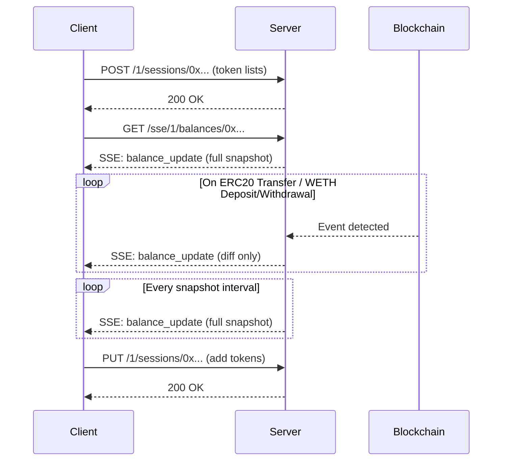

# Token Balances Watcher

Real-time ERC20 token balance tracking service with SSE (Server-Sent Events) support.

## Features

- Real-time balance updates via SSE
- Multicall3 for efficient batch balance queries
- WebSocket subscriptions for ERC20 Transfer events
- WETH wrap/unwrap event listening (Deposit/Withdrawal)
- Multi-chain support (Ethereum, Arbitrum, Sepolia)
- Session-based token list management
- Shared subscriptions for multiple clients watching the same wallet
- Token list caching with TTL (5 hours)
- Token limit per session (max 1000 tokens)
- Diff-based updates (only sends changed balances)

## API Endpoints

### Create Session

Creates a new session with token lists to watch. **Must be called before SSE connection.**

```bash
POST /{chain_id}/sessions/{owner}
Content-Type: application/json

{
  "tokensListsUrls": ["https://tokens.coingecko.com/uniswap/all.json"],
  "customTokens": ["0xTokenAddress1", "0xTokenAddress2"]
}
```

**Response:**
| Status | Description |
|--------|-------------|
| `200 OK` | Session created successfully |
| `400 Bad Request` | `tokensListsUrls` is empty or token limit exceeded |

**Example:**
```bash
curl -X POST http://localhost:8080/1/sessions/0xd8dA6BF26964aF9D7eEd9e03E53415D37aA96045 \
  -H "Content-Type: application/json" \
  -d '{"tokensListsUrls": ["https://tokens.coingecko.com/uniswap/all.json"]}'
```

### Update Session

Adds more tokens to an existing session.

```bash
PUT /{chain_id}/sessions/{owner}
Content-Type: application/json

{
  "tokensListsUrls": ["https://another-list.json"],
  "customTokens": ["0xNewTokenAddress"]
}
```

**Response:**
| Status | Description |
|--------|-------------|
| `200 OK` | Session updated successfully |
| `400 Bad Request` | Both fields empty or token limit exceeded |
| `404 Not Found` | Session does not exist |

### SSE Balances Stream

Subscribe to real-time balance updates. **Requires an active session.**

```bash
curl -N http://localhost:8080/sse/{chain_id}/balances/{owner}
```

**Example (Ethereum mainnet):**
```bash
curl -N http://localhost:8080/sse/1/balances/0xd8dA6BF26964aF9D7eEd9e03E53415D37aA96045
```

**SSE Events:**

| Event | Description |
|-------|-------------|
| `balance_update` | Balance update (full snapshot on connect/interval, or diff on Transfer/WETH events) |
| `error` | Error message |

**Response format:**

```
event: balance_update
data: {"balances":{"0xToken1Address":"1000000","0xToken2Address":"500000"}}

event: error
data: {"code":500,"message":"Error description"}
```

### Get Single Token Balance

```bash
curl http://localhost:8080/{chain_id}/balance/{owner}/{token}
```

**Example:**
```bash
curl http://localhost:8080/1/balance/0xd8dA6BF26964aF9D7eEd9e03E53415D37aA96045/0xdAC17F958D2ee523a2206206994597C13D831ec7
```

### Error Response Format

All error responses follow this structure:

```json
{
  "code": 400,
  "message": "Bad request: tokensListsUrls should not be empty"
}
```

## Usage Flow

1. **Create session** with token lists URLs
2. **Connect to SSE** to receive real-time updates
3. **(Optional)** Update session to add more tokens dynamically



## Environment Variables

| Variable | Description | Default |
|----------|-------------|---------|
| `HTTP_BIND` | Server bind address | `0.0.0.0:8080` |
| `ALCHEMY_API_KEY` | Alchemy API key (required) | - |
| `TOKEN_LIST_PATH` | Path to local token list config | `configs/tokens_list.json` |
| `MULTICALL_ADDRESS` | Multicall3 contract address | `0xcA11bde05977b3631167028862bE2a173976CA11` |
| `SNAPSHOT_INTERVAL` | Balance snapshot interval in seconds | `60` |
| `MAX_WATCHED_TOKENS_LIMIT` | Maximum tokens per session | `1000` |
| `ALLOWED_ORIGINS` | Comma-separated CORS origins | `*` (all) |
| `WETH_CONTRACT_ADDRESSES` | WETH addresses per chain (format: `chainId:address,...`) | Uses predefined addresses |

**Predefined WETH addresses:**
| Network | Address |
|---------|---------|
| Ethereum (1) | `0xC02aaA39b223FE8D0A0e5C4F27eAD9083C756Cc2` |
| Arbitrum (42161) | `0x82aF49447D8a07e3bd95BD0d56f35241523fBab1` |
| Sepolia (11155111) | `0xfFf9976782d46CC05630D1f6eBAb18b2324d6B14` |

## Quick Start

### Local Development

```bash
# Set required environment variable
export ALCHEMY_API_KEY=your_alchemy_api_key

# Run
cargo run
```

### Docker

```bash
# Build
docker-compose build

# Run
docker-compose up -d

# View logs
docker-compose logs -f
```

## Chain IDs

| Network | Chain ID |
|---------|----------|
| Ethereum Mainnet | 1 |
| Arbitrum One | 42161 |
| Sepolia Testnet | 11155111 |

## Blockchain Events Listened

The service subscribes to the following on-chain events via WebSocket:

| Event | Contract | Description |
|-------|----------|-------------|
| `Transfer(address indexed from, address indexed to, uint256 value)` | ERC20 tokens | Triggered when tokens are transferred to/from the watched wallet |
| `Deposit(address indexed dst, uint256 wad)` | WETH | Triggered when ETH is wrapped to WETH |
| `Withdrawal(address indexed src, uint256 wad)` | WETH | Triggered when WETH is unwrapped to ETH |

When any of these events occur, the service fetches the updated balance for the affected token plus the native ETH balance, and broadcasts only the changed balances to connected clients.

## Limits

| Limit | Value | Description |
|-------|-------|-------------|
| Max tokens per session | 1,000 | Maximum number of tokens that can be watched per session |
| Token list cache TTL | 5 hours | Token lists are cached to reduce HTTP requests |
| Session idle TTL | 60 seconds | Sessions with no active SSE clients are cleaned up |
| Broadcast channel capacity | 256 | Maximum pending events per subscription |

## Project Structure

```
src/
├── main.rs              # Entry point
├── args.rs              # CLI arguments
├── app_state.rs         # Application state
├── app_error.rs         # Error types
├── api/                 # HTTP handlers
│   ├── balance.rs       # Single balance endpoint
│   ├── balances.rs      # SSE balances stream
│   ├── create_session.rs # Session creation
│   └── update_session.rs # Session update
├── config/              # Configuration
├── domain/              # Domain models
│   ├── events.rs        # Balance events
│   ├── network.rs       # Network types
│   └── token.rs         # Token types
├── evm/                 # EVM contracts (ERC20, Multicall3)
├── routes/              # Router setup
├── services/            # Business logic
│   ├── subscription_manager.rs  # Shared subscriptions
│   ├── watcher.rs       # Balance watchers
│   ├── balances.rs      # Multicall service
│   └── token_list_fetcher.rs # Token list fetcher
├── infra/               # Infrastructure (providers)
└── tracing/             # Logging setup
```

## Roadmap

### High Priority
- [ ] **Health check endpoint** - `/health` for load balancers and monitoring
- [ ] **Prometheus metrics** - Track subscriptions, RPC latency, WebSocket reconnections
- [x] **Token limit per session** - Max 1000 tokens per session with validation
- [x] **Session expiry/cleanup** - TTL for idle sessions, background cleanup task
- [ ] **Graceful shutdown** - Cancel watchers and close connections on SIGTERM

### Medium Priority
- [ ] **WebSocket reconnection** - Auto-reconnect and resubscribe on WS disconnect
- [ ] **Token list validation** - HTTPS only, domain blocklist, schema validation
- [ ] **Token list fetch retry** - Exponential backoff on failures
- [ ] **SSE heartbeat** - Periodic `:ping` to prevent proxy timeouts

### Features
- [x] **WETH wrap/unwrap listening** - Handle Deposit/Withdrawal events
- [x] **Token lists caching** - Cache with TTL (5h) to reduce HTTP requests
- [ ] **CoW Protocol order events** - Listen for ETH order settlements
- [ ] **ETH transactions listening** - Monitor native balance changes
- [ ] **Reorgs handling** - Detect and handle chain reorganizations
- [ ] **Balance change metadata** - Include txHash, blockNumber, previousBalance
- [ ] **Batch balance endpoint** - One-off multi-token queries without SSE
- [ ] **Allowances tracking** - ERC20 Approval events and allowances in snapshot
- [ ] **OpenAPI docs** - Auto-generate API docs with utoipa

## License

MIT
