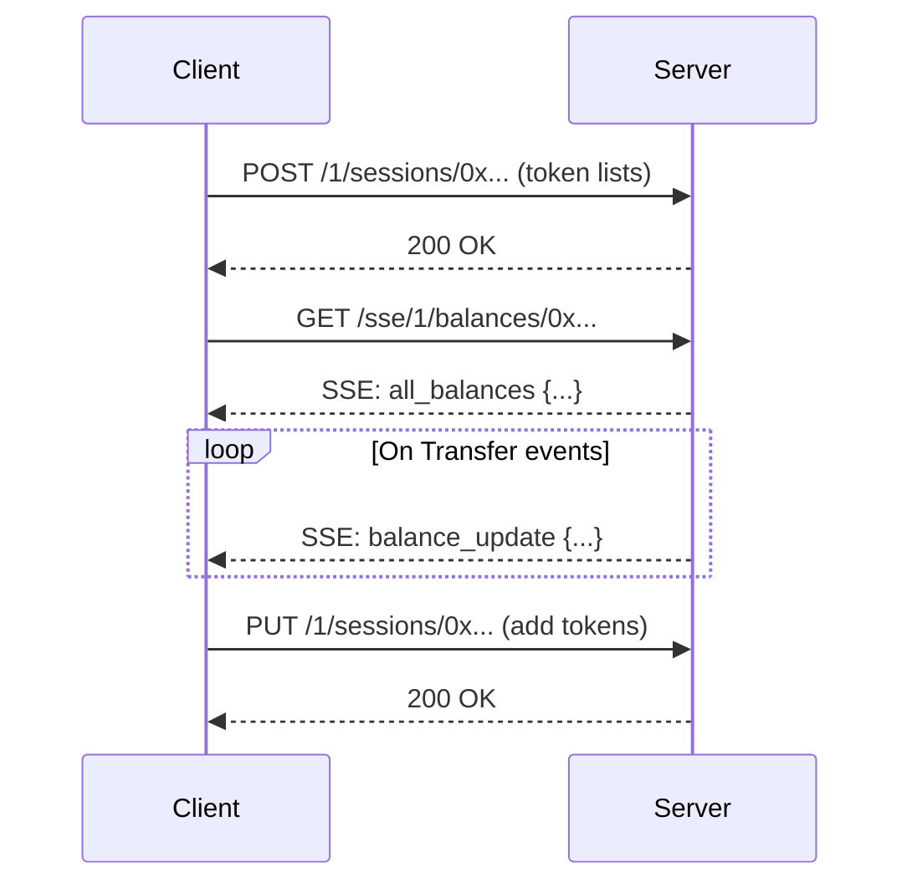

# Token Balances Watcher

Real-time ERC20 token balance tracking service with SSE (Server-Sent Events) support.

## Features

- Real-time balance updates via SSE
- Multicall for batch balance queries
- WebSocket subscriptions for Transfer events
- Multi-chain support (Ethereum, Arbitrum, Sepolia)
- Session-based token list management
- Shared subscriptions for multiple clients

## API Endpoints

### Create Session

Creates a new session with token lists to watch. **Must be called before SSE connection.**

```bash
POST /{chain_id}/sessions/{owner}
Content-Type: application/json

{
  "tokensListsUrls": ["https://tokens.coingecko.com/uniswap/all.json"],
  "customTokens": ["0xTokenAddress1", "0xTokenAddress2"]
}
```

**Example:**
```bash
curl -X POST http://localhost:8080/1/sessions/0xd8dA6BF26964aF9D7eEd9e03E53415D37aA96045 \
  -H "Content-Type: application/json" \
  -d '{"tokensListsUrls": ["https://tokens.coingecko.com/uniswap/all.json"]}'
```

### Update Session

Adds more tokens to an existing session.

```bash
PUT /{chain_id}/sessions/{owner}
Content-Type: application/json

{
  "tokensListsUrls": ["https://another-list.json"],
  "customTokens": ["0xNewTokenAddress"]
}
```

### SSE Balances Stream

Subscribe to real-time balance updates. **Requires an active session.**

```bash
curl -N http://localhost:8080/sse/{chain_id}/balances/{owner}
```

**Example (Ethereum mainnet):**
```bash
curl -N http://localhost:8080/sse/1/balances/0xd8dA6BF26964aF9D7eEd9e03E53415D37aA96045
```

**SSE Events:**

| Event | Description |
|-------|-------------|
| `all_balances` | Full balance snapshot (sent on connect and every interval) |
| `balance_update` | Single token balance update (on Transfer event) |
| `error` | Error message |

**Response format:**

```
event: all_balances
data: {"balances":{"0xToken1Address":"1000000","0xToken2Address":"500000"}}

event: balance_update
data: {"address":"0xTokenAddress","balance":"1500000"}
```

### Get Single Token Balance

```bash
curl http://localhost:8080/{chain_id}/balance/{owner}/{token}
```

**Example:**
```bash
curl http://localhost:8080/1/balance/0xd8dA6BF26964aF9D7eEd9e03E53415D37aA96045/0xdAC17F958D2ee523a2206206994597C13D831ec7
```

## Usage Flow

1. **Create session** with token lists URLs
2. **Connect to SSE** to receive real-time updates
3. **(Optional)** Update session to add more tokens dynamically



## Environment Variables

| Variable | Description | Default |
|----------|-------------|---------|
| `HTTP_BIND` | Server bind address | `0.0.0.0:8080` |
| `ETH_RPC` | Ethereum HTTP RPC URL | - |
| `ETH_WC_RPC` | Ethereum WebSocket RPC URL | - |
| `ARBITRUM_RPC` | Arbitrum HTTP RPC URL | - |
| `SEPOLIA_RPC` | Sepolia HTTP RPC URL | - |
| `SEPOLIA_WC_RPC` | Sepolia WebSocket RPC URL | - |
| `MULTICALL_ADDRESS` | Multicall3 contract address | `0xcA11bde05977b3631167028862bE2a173976CA11` |
| `SNAPSHOT_INTERVAL` | Balance snapshot interval in seconds | `60` |

## Quick Start

### Local Development

```bash
# Set environment variables
export ETH_RPC=https://eth.llamarpc.com
export ETH_WC_RPC=wss://eth.drpc.org

# Run
cargo run
```

### Docker

```bash
# Build
docker-compose build

# Run
docker-compose up -d

# View logs
docker-compose logs -f
```

## Chain IDs

| Network | Chain ID |
|---------|----------|
| Ethereum Mainnet | 1 |
| Arbitrum One | 42161 |
| Sepolia Testnet | 11155111 |

## Project Structure

```
src/
├── main.rs              # Entry point
├── args.rs              # CLI arguments
├── app_state.rs         # Application state
├── app_error.rs         # Error types
├── api/                 # HTTP handlers
│   ├── balance.rs       # Single balance endpoint
│   ├── balances.rs      # SSE balances stream
│   ├── create_session.rs # Session creation
│   └── update_session.rs # Session update
├── config/              # Configuration
├── domain/              # Domain models
│   ├── events.rs        # Balance events
│   ├── network.rs       # Network types
│   └── token.rs         # Token types
├── evm/                 # EVM contracts (ERC20, Multicall3)
├── routes/              # Router setup
├── services/            # Business logic
│   ├── subscription_manager.rs  # Shared subscriptions
│   ├── watcher.rs       # Balance watchers
│   ├── balances.rs      # Multicall service
│   └── tokens_from_list.rs # Token list fetcher
├── infra/               # Infrastructure (providers)
└── tracing/             # Logging setup
```

## Roadmap

### High Priority
- [ ] **Health check endpoint** - `/health` for load balancers and monitoring
- [ ] **Prometheus metrics** - Track subscriptions, RPC latency, WebSocket reconnections
- [ ] **Rate limiting** - Limit sessions per IP and tokens per session
- [ ] **Session expiry/cleanup** - TTL for idle sessions, background cleanup task
- [ ] **Graceful shutdown** - Cancel watchers and close connections on SIGTERM

### Medium Priority
- [ ] **WebSocket reconnection** - Auto-reconnect and resubscribe on WS disconnect
- [ ] **Token list validation** - HTTPS only, domain blocklist, schema validation
- [ ] **Token list fetch retry** - Exponential backoff on failures
- [ ] **SSE heartbeat** - Periodic `:ping` to prevent proxy timeouts

### Features
- [ ] **WETH wrap/unwrap listening** - Handle Deposit/Withdrawal events
- [ ] **Token lists caching** - Cache with TTL to reduce HTTP requests
- [ ] **CoW Protocol order events** - Listen for ETH order settlements
- [ ] **ETH transactions listening** - Monitor native balance changes
- [ ] **Reorgs handling** - Detect and handle chain reorganizations
- [ ] **Balance change metadata** - Include txHash, blockNumber, previousBalance
- [ ] **Batch balance endpoint** - One-off multi-token queries without SSE
- [ ] **Allowances tracking** - ERC20 Approval events and allowances in snapshot
- [ ] **OpenAPI docs** - Auto-generate API docs with utoipa

## License

MIT
